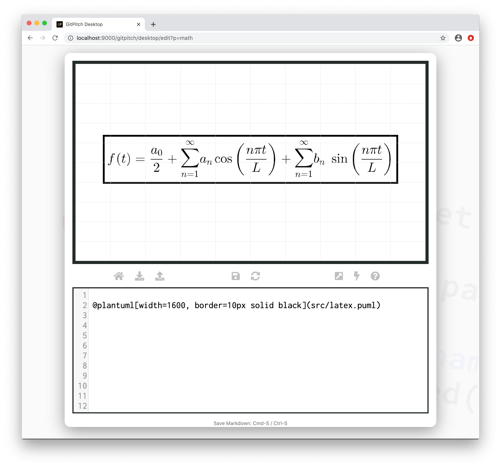
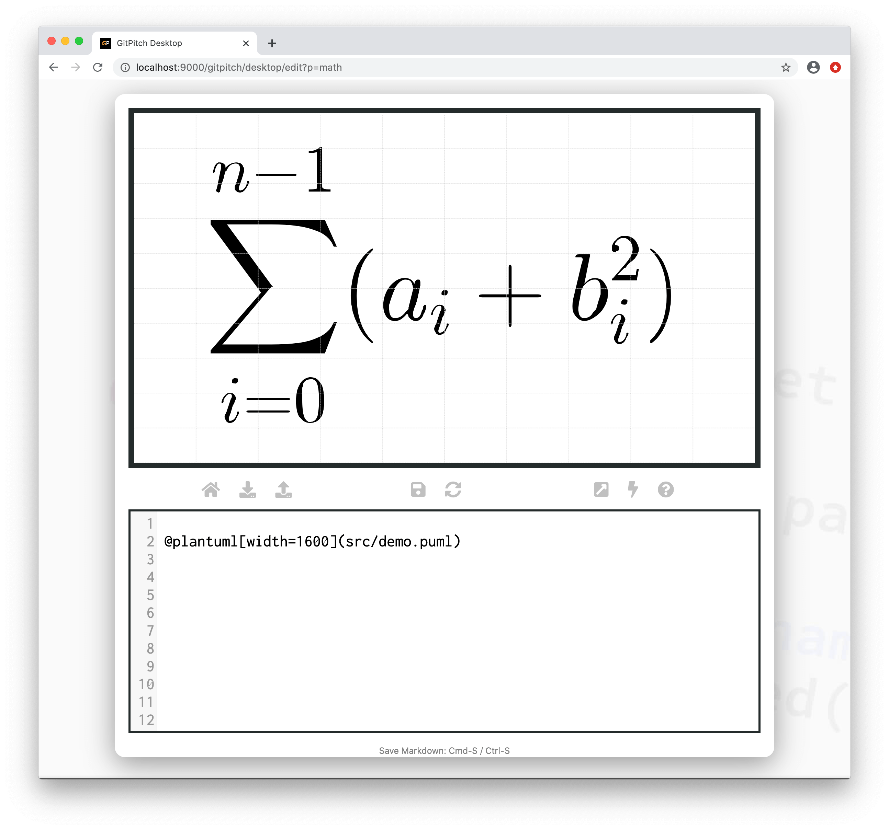

# LaTeX + AsciiMath

?> GitPitch widgets greatly enhance traditional markdown rendering capabilities for slide decks.

The [PlantUML Widget](/diagrams/plantuml.md) is a special markdown syntax that can be used to render [PlantUML Diagrams](https://plantuml.com/). This widget includes special extensions for rendering LaTeX math formulas on any slide. 

### PlantUML Maths

You can use [AsciiMath](http://asciimath.org/) or [JLaTeXMath](https://github.com/opencollab/jlatexmath) notation to generate diagrams containing math formulas using the plantuml widget.

### Widget Paths

All paths to plantuml description files specified within [PITCHME.md](/conventions/pitchme-md.md) markdown must be relative to the *root directory* of your local working directory or Git repository.

### Widget Syntax

The following markdown snippet demonstrates plantuml widget syntax for LaTeX maths:

```markdown
@plantuml[properties...](path/to/file.puml)
```

?> The `properties...` list expects a comma-separated list of property `key=value` pairs.

Each math diagram is defined using a simple text-based syntax within a dedicated description file. The exact syntax is defined by the [PlantUML Maths Project](https://plantuml.com/ascii-math). The following conventions are enforced:

1. *PlantUML* math descriptions **must** be defined in a file within your local repository.
1. These *PlantUML* math description files must have a **.puml** extension.
1. The contents of your math description files must adhere to valid [PlantUML Maths](https://plantuml.com/ascii-math) syntax.

[PlantUML Properties](../_snippets/diagrams-plantuml-properties.md ':include')

### Sample Slide

The following slide demonstrates a sample LaTeX diagram rendered using plantuml widget syntax. The markdown snippet used to create this slide takes advantage *grid native properties* to position, size, and transform the diagram on the slide:



?> The `width` property is **required** to set the size of the generated PlantUML math diagram.

The contents of the sample `src/latex.puml` file used above is shown here:

```
@startmath
f(t)=(a_0)/2 + sum_(n=1)^ooa_ncos((npit)/L)+sum_(n=1)^oo b_n\ sin((npit)/L)
@endmath
```

Ths following slide demonstrates another sample LaTex diagram rendered using plantuml widget syntax:



?> The `width` property is **required** to set the size of the generated PlantUML math diagram.

The contents of the sample `src/demo.puml` file used above is shown here:

```
@startlatex
\sum_{i=0}^{n-1} (a_i + b_i^2)
@endlatex
```

?> Supported PlantUML math diagram syntax is defined by the [PlantUML Maths Project](https://plantuml.com/ascii-math).

