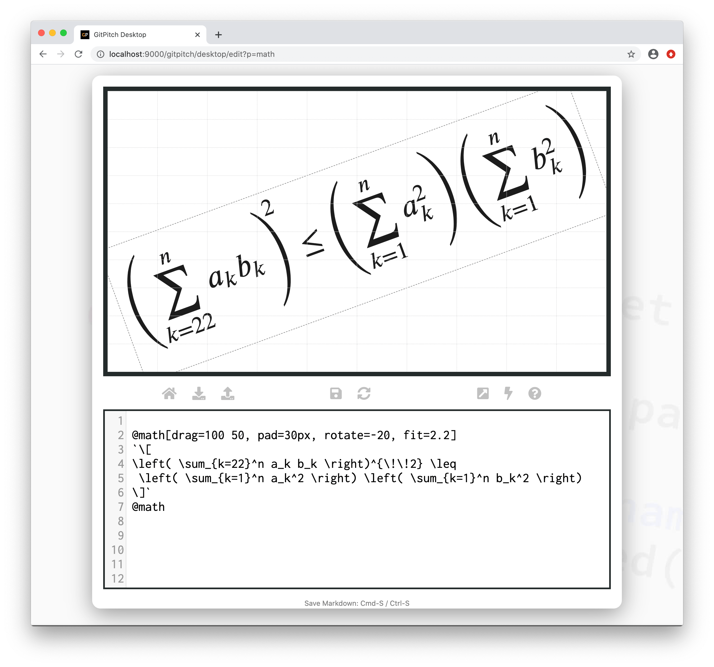
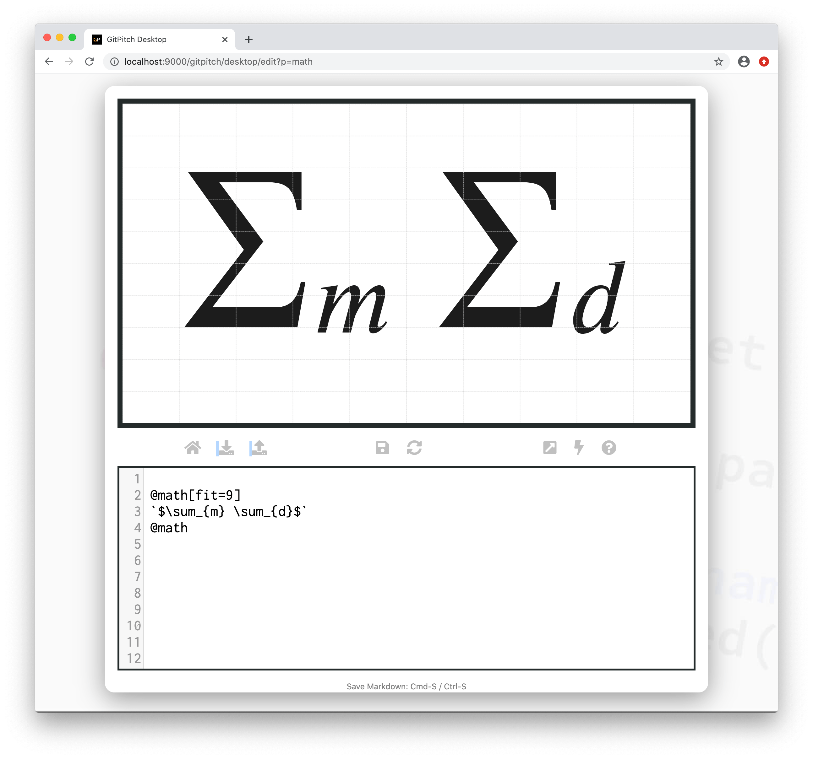

# MathJax Formulas

MathJax support is disabled by default. When enabled you can render [MathJax Formulas](https://www.mathjax.org/) on any side. 

### Activation

To enable MathJax for your slide deck activate the `mathjax` setting in your [PITCHME.yaml](/conventions/pitchme-yaml.md):

```yaml
mathjax : TeX-MML-AM_HTMLorMML-full
```

Once this setting is enabled you can use [Math Widget](#math-widget) syntax to render your formulas.

### Math Widget

The following markdown snippet demonstrates math widget syntax:

```markdown
@math[properties...]
Your MathJax formulas go here.
@math
```

?> The `properties...` list expects a comma-separated list of property `key=value` pairs.

### Grid Native Props

The *Math Widget* is a [grid native widget](/grid-layouts/native-widgets.md) meaning it also directly supports [grid layouts](/grid-layouts/) properties:

[Grid Widget Properties](../_snippets/grid-widget-properties.md ':include')

### Sample Slide

The following slide demonstrates a math formula rendered using math widget syntax. The markdown snippet used to create this slide takes advantage of numerous *grid native properties* to position, size, and transform the formula on the slide:



Remember to [activate MathJax](#activation) for your deck and then copy this markdown snippet to experiment with math formulas on your own slide deck:

```markdown
@math[drag=100 50, pad=30px, rotate=-20, fit=2.2]
`\[
\left( \sum_{k=22}^n a_k b_k \right)^{\!\!2} \leq
 \left( \sum_{k=1}^n a_k^2 \right) \left( \sum_{k=1}^n b_k^2 \right)
\]`
@math
```

### Broken Syntax

In some circumstances the syntax in your math formulas may conflict with the markdown processor that parses your **PITCHME.md** file. When this happens math formulas may render incorrectly on your slide.

If a formula does not render as expected on your slides, try enclosing your formula in *backticks*. This will give the markdown processor a better chance of rendering your formula correctly.

For example, the following formula demonstrates broken rendering:

```markdown
@math[
$\sum_{m} \sum_{d}$
@math
```

This following markdown snippet uses *backticks* to solve the rendering problems with this formula:

```markdown
@math
`$\sum_{m} \sum_{d}$`
@math
```

With *backticks* enhanced syntax this math formula renders cleanly as follows:


