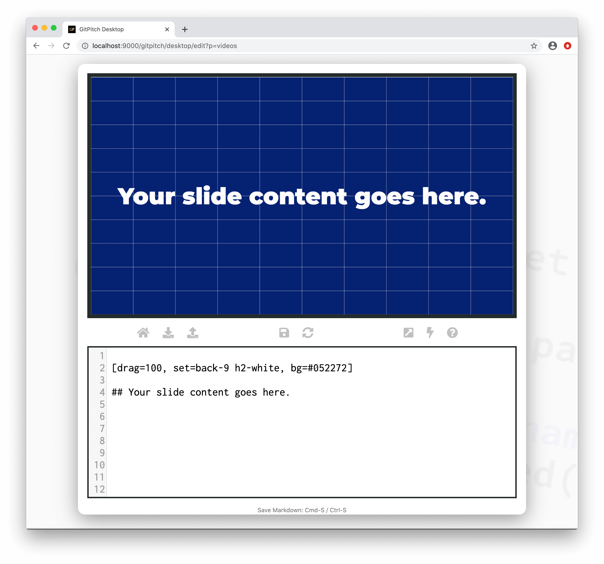
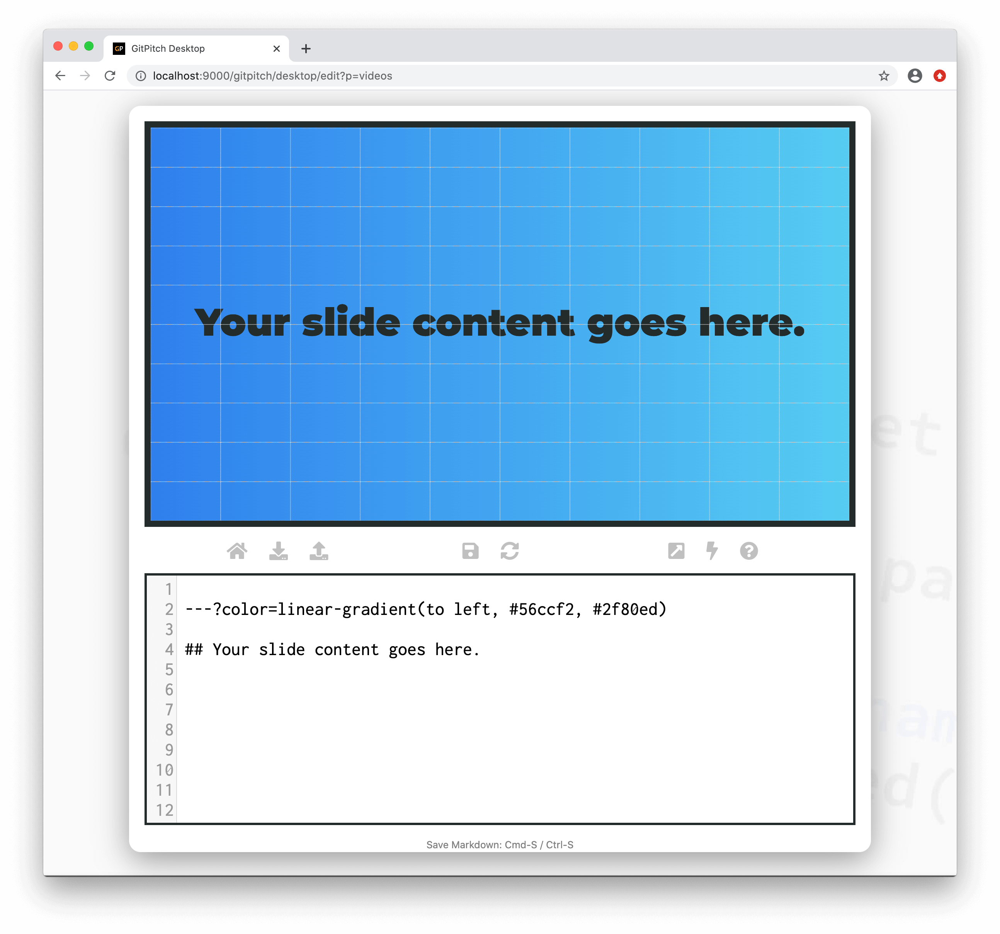

# Color Backgrounds

Using a dedicated [grid layouts block](grid-layouts/drag-and-drop.md) you can create a custom color background for any side. Any additional content on the slide is overlaid on top of the dedicated color background block.

?> For further details about color and image backgrounds see the [Grid Backgrounds Guide](/grid-layouts/backgrounds.md).

### Solid Colors

The following basic syntax is used to activate a custom color background for any slide:

```
[drag=100, set=back-9, bg=color]

Additional slide content goes here.
```

Note the use and purpose of the following properties:

1. The *color* option on the `bg=` property takes any valid [CSS Color Value](https://developer.mozilla.org/en-US/docs/Web/CSS/color_value).
1. The `drag=100` property values ensures the colored block covers the entire area of the slide.
1. The `set=back-9` property value ensures the colored block remains in the background.

The following sample slide screenshot demonstrates a slide color background:



### Gradient Colors

Special `--?color=` delimiter syntax can be used to activate a color gradient background for any slide:

```markdown
---?color=linear-gradient(to left, #56ccf2, #2f80ed)

Additional slide content goes here.

```

The `--?color=` delimiter takes any valid linear gradient value as defined by the [CSS Gradients Guide](https://developer.mozilla.org/en-US/docs/Web/CSS/linear-gradient).



?> For some stunning background color gradient inspiration check out [UI Gradients](https://uigradients.com).

