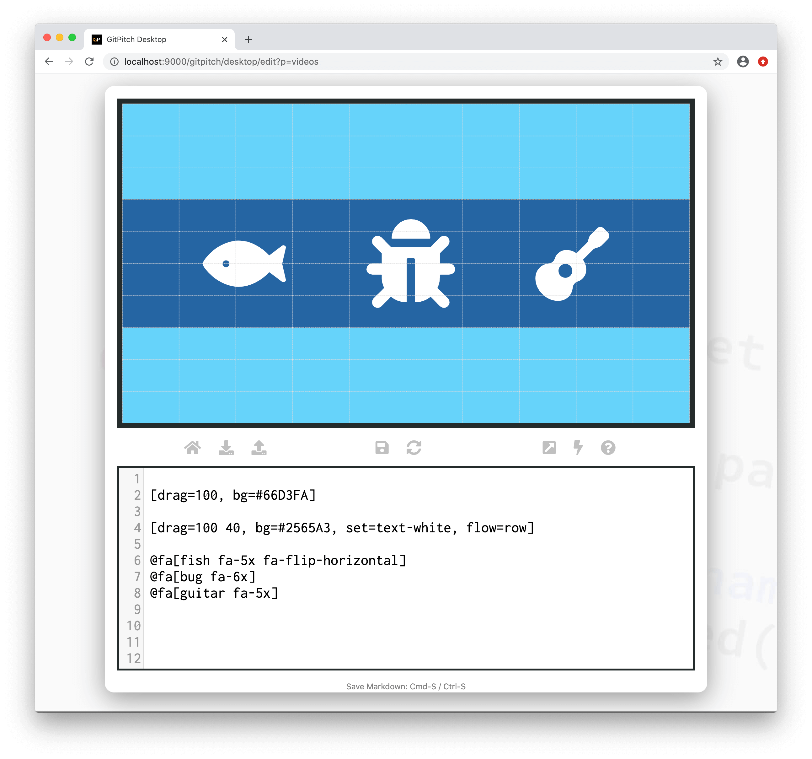

# Font Awesome

?> GitPitch widgets greatly enhance traditional markdown rendering capabilities for slide decks.

The Font Awesome widgets can be used to render [Font Awesome 5 Icons](https://fontawesome.com/icons?d=gallery&s=brands,solid,regular) on any slide.



### Solid Icons

The *solid icon* widget syntax is as follows:

```markdown
@fa[solid-icon-name]
```

Where *solid-icon-name* identifies any of the over *1500 solid icons* listed in
the [FA5 Solid Icons Gallery](https://fontawesome.com/icons?d=gallery&s=solid).

### Regular Icons

The *regular icon* widget syntax is as follows:

```markdown
@far[regular-icon-name]
```

Where *regular-icon-name* identifies any of the over *100 regular icons*
listed in the [FA5 Regular Icons Gallery](https://fontawesome.com/icons?d=gallery&s=regular).

For example, to render the **fa-building** icon on a slide use the following syntax:

```markdown
@far[building]
```

### Brand Icons 

The *brand icon* widget syntax is as follows:

```markdown
@fab[brand-icon-name]
```

Where *brand-icon-name* identifies any of the over *400 brand icons* listed in
the [FA5 Brand Icons Gallery](https://fontawesome.com/icons?d=gallery&s=brands).

For example, to render the **fa-docker** icon on a slide use the following
syntax:

```markdown
@fab[docker]
```

### Icon Sizing

You can easily control the size of any icon on your GitPitch slides:

```markdown
@fa[umbrella fa-xxx]
```

Here *fa-xxx* can take any of the following values for progressively larger icons:

- fa-xs
- fa-sm
- fa-lg
- fa-2x
- fa-3x
- fa-4x
- fa-5x
- fa-7x
- fa-10x

### Icon Rotations

You can rotate, flip, or mirror an icon on your GitPitch slides:

```markdown
@fa[snowman fa-xxx]
```

Here *fa-xxx* can take any of the following rotation values:

- fa-rotate-90
- fa-rotate-180
- fa-rotate-270
- fa-flip-horizontal
- fa-flip-vertical
- fa-flip-both

### Icon Animations

You can spin or pulse (rotate-in-8-steps) any icon on your GitPitch slides:

```markdown
@fa[spinner fa-xxx]
```

Here *fa-xxx* can take any of the following animation values:

- fa-spin
- fa-pulse

> Font Awesome icon animations are best used with the set of [Font Awesome 5 Spinner Icons](https://fontawesome.com/icons?d=gallery&c=spinners&m=free).

### Custom Styles

Beyond the use of icon labels, sizing, and animations you can also create your own custom CSS styling rules and activate those styles for any icon. For example, to activate a [custom color](/theme/custom-css.md) for an icon on your slide use the following CSS snippet:

```css
.shocking-pink { color : #fc0fc0; }
```

Then apply this color to the Font Awesome icon on your slide by using your your custom CSS class as follows:

```markdown
@fa[puzzle-piece fa-spin shocking-pink]
```

The resultant icon will be rendered using the color identified by your *.shocking-pink* class. In this example, the icon will also automatically rotate thanks to the use of the [fa-spin animation](#icon-animations) class.

