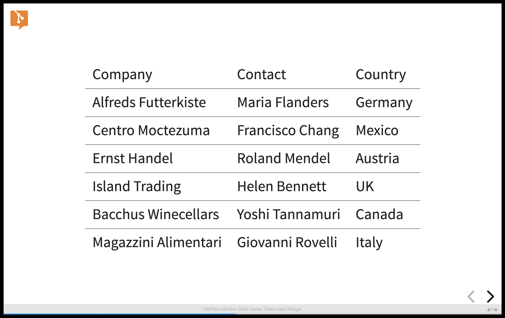
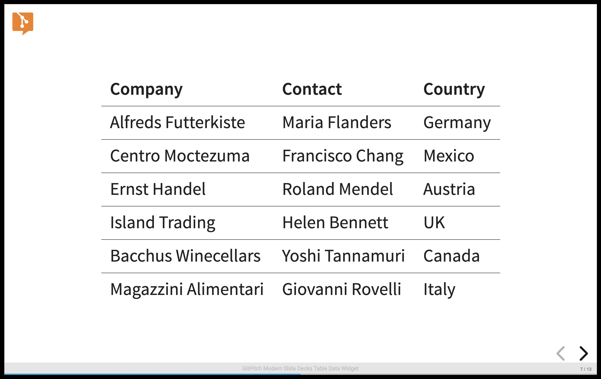
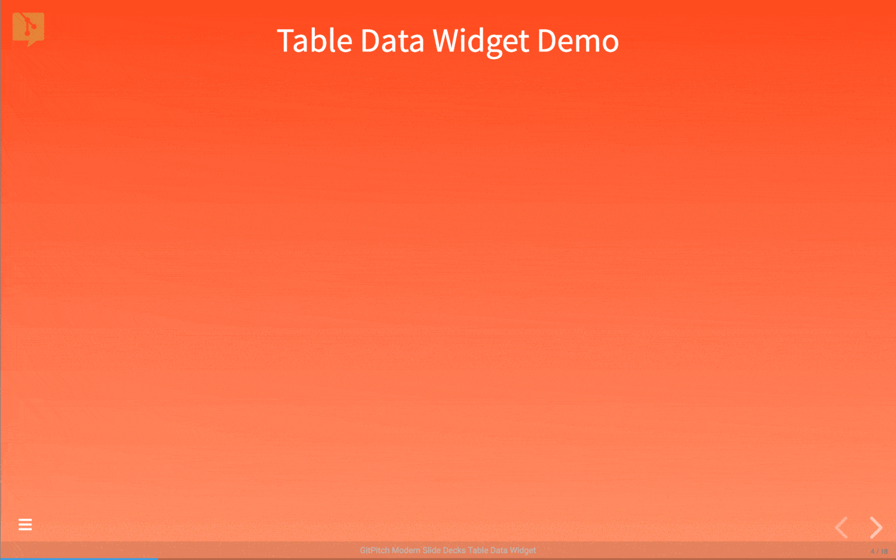
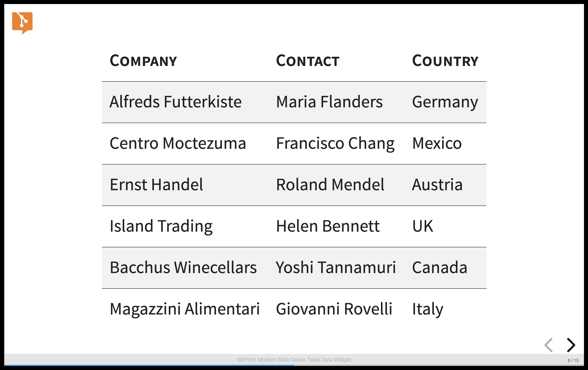

# Table Data

?> GitPitch widgets greatly enhance traditional markdown rendering capabilities for slide decks.

The table widget renders comma-separated and tab-separated file data as tables on any slide.

<iframe id="youtube" width="900" height="600" src="https://www.youtube.com/embed/e48Wa3lqfcY" frameborder="0" allow="accelerometer; autoplay; encrypted-media; gyroscope; picture-in-picture" allowfullscreen></iframe>

### Widget Paths

All paths to table data files specified within [PITCHME.md](/conventions/pitchme-md.md) markdown must be relative to the *root directory* of your local working directory or Git repository.

### Widget Syntax

The following markdown snippet demonstrates table widget syntax:

```
@table[property...](path/to/data.csv)
```

?> The `properties...` list expects a space-separated list of table property values.

### Table Properties

The table widget supports the following table specific properties:

[Table Widget Properties](../_snippets/table-widget-properties.md ':include')

### Basic Usage

The following markdown snippet demonstrates table widget basic rendering:

```markdown
@table[](path/to/sample.csv)
```

This sample markdown snippet renders as follows:



### Data Headers

The first row in a *comma-separated* or *tab-separated* data file may contain header information. If your data file contains header information activate the built-in `table-header` property on your table widget as follows:

```markdown
@table[table-header](path/to/sample.csv)
```

This markdown snippet renders as follows:



You can further customize the appearance of table headers and rows using [Custom Table Styles](#custom-styles).

### Data Fragments

When you need to introduce each row of data in your table *step-by-step* activate the built-in **table-fragment** property on your table widget as follows:

```markdown
@table[table-header table-fragment](path/to/sample.csv)
```

This markdown snippet renders as follows:



### Tabbed Data

By default, the table widgets expects *comma-separated* values in your files. If your data file uses *tab* delimiters instead, activate the built-in `table-tsv` property on your widget as follows:

```markdown
@table[table-header table-tsv](path/to/sample.tsv)
```

This markdown snippet renders as follows:


### Custom Styles

To activate custom table styles for your table widget data you can define [custom CSS styles](/theme/custom-css.md) and then activate those styles as *properties* on your widgets. For example, see the following sample custom CSS style rules: 

```css
table.custom-header th {
  font-variant: small-caps;
}

table.custom-row tr:nth-child(even) {
  background-color: #f2f2f2;
}

table.custom-spacing th, table.custom-spacing td {
  padding: 15px;
}
```

These sample custom styles rules are designed to modify the appearance of a table as follows:

1. Table headings are rendered using a *small-caps* font variant.
1. Table rows are rendered using alternating striped backgrounds using custom color.
1. Table header and table data padding is set to a custom 15px size per style rule.

These custom CSS style rules can be activated as *properties* on a table widget as follows:

```markdown
@table[table-header custom-header custom-row custom-spacing](path/to/sample.csv)
```

This markdown snippet render as follows:



The use of custom CSS style rules to customize the appearance of tables generated by the table widget is entirely optional.  Default table styling is determined by the [base theme](/theme/template.md) for your slide deck.

