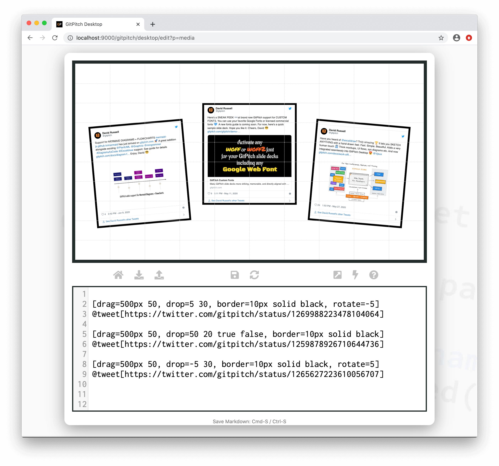

# Embed Tweets

?> GitPitch widgets greatly enhance traditional markdown rendering capabilities for slide decks.

The tweet widget can be used to render [Tweets](https://twitter.com/gitpitch) on any slide.



### Widget Syntax

The following markdown snippet demonstrates tweet widget syntax:

```markdown
[drag=500px 50, border=10px solid black]
@tweet[https://twitter.com/account/status/tweetid]
```

The tweet widget does not directly accept properties to control it's size or position on the slide. So when embedding a tweet on your slide it is strongly *recommended* that use a [grid layouts block](/grid-layouts/drag-and-drop.md) to control the placement and styling of your tweet.

### Fixed Width

As demonstrated above recommended [widget syntax](#widget-syntax) uses a `drag=500px 50` property to size the tweet content. The fixed width value is specified to match the embedded content served by *twitter.com*.

To render an embedded tweet cleanly the width *should* always be set to **500px**. However the height can be adjusted to match the actual content of the embedded tweet on your slide.

### Border Style

For aesthetic purposes activating a [grid layouts border](/grid-layouts/borders.md) around the block used to position an embedded tweet on your slide is recommended.

### Offline Support

Tweets are dependent on content served by *twitter.com*. As such, if you are working offline tweet content will be temporarily unavailable.

GitPitch attempts to handle this gracefully by automatically replacing the fully rendered tweet with a simple link to the tweet online. Once network access has been restored, the fully rendered tweet will be displayed once again.

### Content Blocking

Modern web browsers offer sophisticated content blocking policies, which include smart tracking protection. In most cases, this is a very good thing for end-users. However, depending on the content-blocking policies activated in your Web browser, tweets served by twitter.com may be prevented from rendering on your slides.

As you have no control over the Web content blocking policies of your audience, this note is simply provided to draw your attention to these policies and their potential consequences for your slides. If needed, you can inform your audience accordingly.
