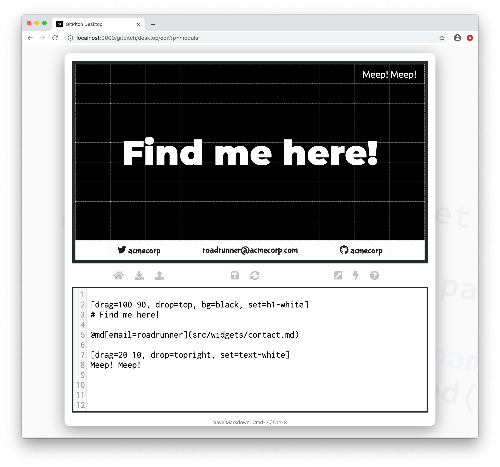

# Markdown Globals

Markdown [variables](/modular-markdown/variables.md) are used to customize the appearance, content, and behavior of modular markdown snippets rendered by the [markdown injection widget](/modular-markdown/injection.md). Markdown globals are a way to provide default values for custom variables used by your modular markdown snippets. 

### Activation

To enable global defaults for markdown variables you must activate the `globals` setting in the [PITCHME.yaml](/conventions/pitchme-yaml.md) for your slide deck. For example:

```yaml
globals: [ "color=white", "social=acmecorp", "email=support" ]
```

?> The `globals` setting takes a list of string values that define `key=default-value` pairs.

These globals are used as fallback values for any custom variables within modular markdown snippets that can not be satisified by the variable values passed on an instance of the [markdown injection widget](/modular-markdown/injection.md).

### Sample Slide

Lets revisit the markdown snippet introduced within the [Markdown Variables Guide](/modular-markdown/variables.md). The original markdown snippet with variables is shown here for your convenience:

```markdown
[drag=100 10, drop=bottom, flow=row, font=bubblegum, bg={{color}}]
@fa[twitter] {{social}}
{{email}}@acmecorp.com
@fa[github] {{social}}
```

We saw how this modular markdown snippet was used to create the following sample slide:


This next sample demonstrates how this same markdown snippet is rendered when only the custom `email=` variable is set as a property on the markdown injection widget. Note the `color=` and `social=` variables are omitted on this instance of the widget:



Looking at the resulting slide we can see that the global defaults `color=white` and `social=roadrunner` have been automatically applied when rendering the `src/widgets/contact.md` snippet using the markdown injection widget.

