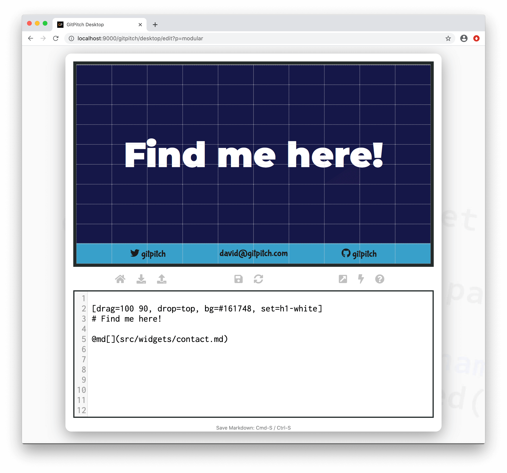

# Markdown Injection

GitPitch lets you manage slide decks the same way you manage code. So how do we manage code?

One way we manage code is to simplify large, complex code bases. By refactoring or restructing code into more modular, managable chunks. Think modules, classes, methods, functions, etc. GitPitch lets you adopt this same modular approach to derive the same benefits for markdown used by your slide decks.

?> Refactored code makes it easier to read. Easier to maintain. And often easier to **reuse**. These same advantages can be enjoyed for slide markdown too. Within standalone slide decks. And even more so when developing training materials that continue to evolve over time.


### Basics

Markdown injection provides a simple way inject *reusable markdown* snippets on any slide. This feature is particularly useful when you find yourself repeating patterns of markdown on multiple slides. Or repeating patterns of markdown across multiple slide decks.

### Widget Paths

All paths to markdown injection snippet files specified within [PITCHME.md](/conventions/pitchme-md.md) markdown must be relative to the root directory of your local working directory or Git repository.

### Widget Syntax

The following markdown snippet demonstrates markdown injection widget syntax:

```markdown
@md[properties...](path/to/snippet.md)
```
?> The `properties...` list expects a comma-separated list of custom variable `key=value` pairs.

The use of properties on this widget is discussed in detail in the [Markdown Variables Guide](/modular-markdown/variables.md).

Markdown injection widgets experience simple inline replacement using the corresponding `path/to/snippet.md` file content before your slide deck is rendered to the browser.

### Sample Slide

Assume the following markdown snippet is used on numerous slides or across numerous slide decks:

```markdown
[drag=100 10, drop=bottom, flow=row, font=bubblegum, bg=#39a0ca]
@fa[twitter] gitpitch
david@gitpitch.com
@fa[github] gitpitch
```

Extract this markdown snippet into a dedicated markdown file within your local working directory, for example, into the file `src/widgets/contact.md`. The following slide demonstrates the use of the markdown injection widget to render this markdown snippet alongside other content on a sample slide:



This simple example demonstrates the basic injection mechanism. But so far markdown injection looks a bit like a function that takes no arguments. Useful, sure. But with limited utility. However just as a function that takes arguments becomes a whole lot more interesting. So does injection using [custom variables](/modular-markdown/variables.md).

