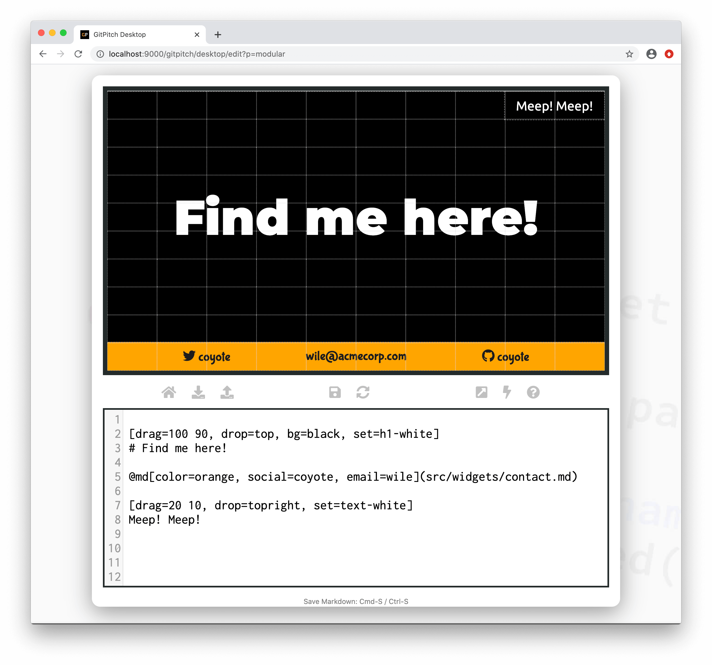
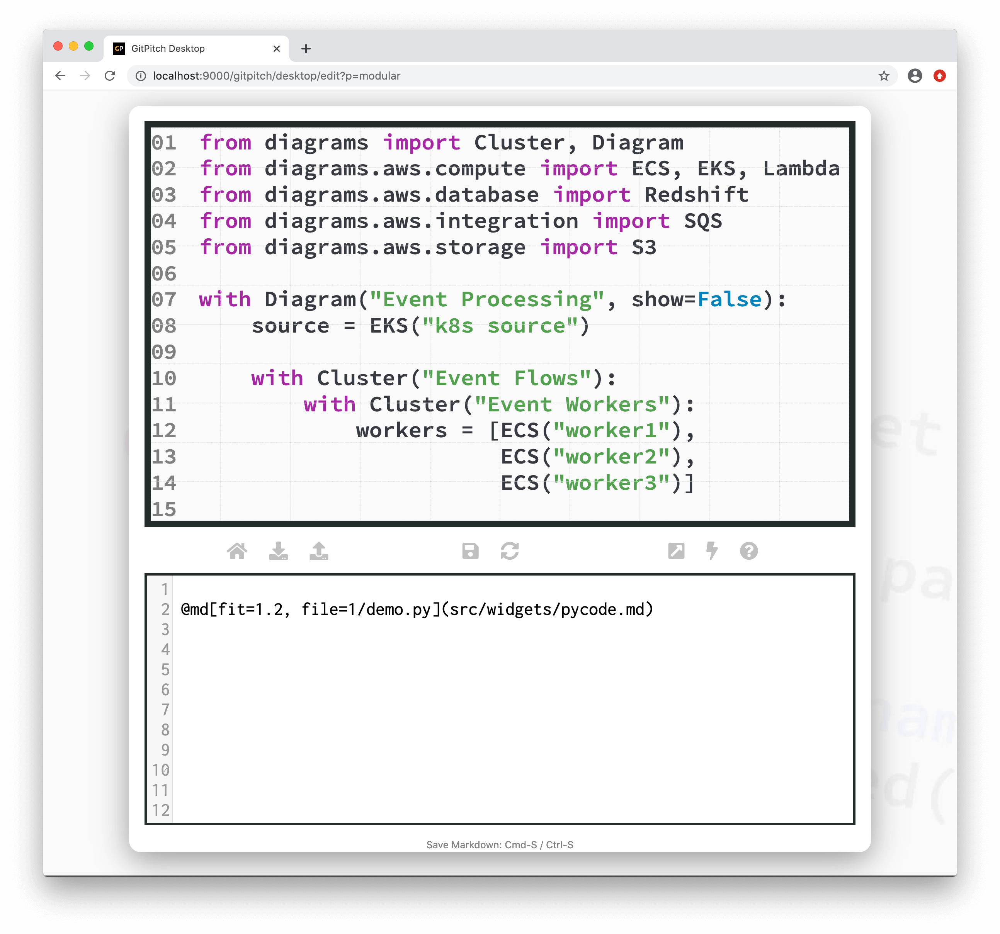

# Markdown Variables

The [markdown injection widget](/modular-markdown/injection.md) provides a simple way to inject a reusable markdown snippet on any slide. Basic injection described [here](/modular-markdown/injection.md) involves inline replacement of a widget with a static markdown snippet.

Markdown injection with variables unlocks a dynamic markdown injection engine for your slide decks. Variables can be used to customize the appearance, content, and behavior of injected markdown.

### Widget Paths

All paths to markdown injection snippet files specified within [PITCHME.md](/conventions/pitchme-md.md) markdown must be relative to the root directory of your local working directory or Git repository.

### Widget Syntax

The following markdown snippet demonstrates markdown injection widget syntax:

```markdown
@md[properties...](path/to/snippet.md)
```
?> The `properties...` list expects a comma-separated list of custom variable `key=value` pairs.

Custom variables specified as `properties...` on this widget are what activates the dynamic appearance, content, and behaviors for your modular markdown snippets.

### Custom Variables

A custom variable is simply a `key=value` pair passed as a property on the markdown injection widget.

Each `key=` can be named to anything you want. But typically keys are named to identify their purpose. For example, a variable with key named `color=` would likely expect a color value. While a variable with a key named `title=` would likely expect title text on the its value, etc.

Variables passed as `properties...` on the markdown injection widget are available within the corresponding markdown snippet when the widget is being rendered on your slide. For example:

- The value on the `color=` variable is accessed within a snippet using `{{color}}` syntax.
- The value on the `title=` variable is accessed within a snippet using `{{title}}` syntax.

### Sample Slide

Lets revisit the markdown snippet introduced within the [Markdown Injection Guide](/modular-markdown/injection.md). The original static markdown snippet is shown here for your convenience:

```markdown
[drag=100 10, drop=bottom, flow=row, font=bubblegum, bg=#39a0ca]
@fa[twitter] gitpitch
david@gitpitch.com
@fa[github] gitpitch
```

We can update this markdown snippet to accept a number of markdown variables:

```markdown
[drag=100 10, drop=bottom, flow=row, font=bubblegum, bg={{color}}]
@fa[twitter] {{social}}
{{email}}@acmecorp.com
@fa[github] {{social}}
```

The following variables are now defined for this markdown snippet:

- {{color}} a value that defines a [background color](/grid-layouts/backgrounds.md) for the layout block
- {{social}} a value indicating the social media handle for the speaker
- {{email}} a value indicating the email account name for the speaker

Now that our markdown snippet can be customized using variables lets put it to use on a sample slide:



Here the custom variables `color=orange`, `social=coyote`, and `email=wile` were activated on the instance of the markdown injection widget on this sample slide.

> You might be wondering what happens when one or more variables required by a markdown snippet are omitted from the `properties...` list passed to a markdown injection widget? The answer is default values are used. As described in the [Markdown Globals Guide](/modular-markdown/globals.md).

### Advanced Usage

Markdown injection with variables is not limited to simple slide fragments. In fact markdown injection with variables can be used to create brand new markdown widgets. Widgets you can reuse across slides and even across slide decks.

Lets assume we are going to create a training course to teach Python language fundamentals. We expect our training course slide deck will include lots and lots of Python source code slides. Typically we would turn to the [code widget](/code/widgets.md) to render our sample code. Each code slide would use markdown similar to this:

```markdown
@code[python code-line-numbers, drag=100, fit=1.4](src/week/1/demo.py)
```

You may notice that even for this single line of markdown there is quite a bit of fixed *ceremony*:

- The code [language hint](/code/) will always indicate `python` for this course.
- The [code-line-numbers](/code/behaviors.md) behavior will be activate on all slides.
- And the grid layouts [drag-and-drop](/grid-layouts/drag-and-drop.md) positioning and sizing will be used consistently.

All of which is a good sign that this might be an opportunity to create a custom markdown widget. Lets start by defining the following markdown snippet:

```markdown
@code[python code-line-numbers, drag=100, fit={{fit}}](src/week/{{file}})
```

This markdown snippet represents a generalization of the markdown we would need when rendering our sample Python code slides. Now that we have a markdown snippet with variables defined we could use this snippet as a custom markdown widget throughout our training slide decks. For example:



If you look at the markdown on this sample slide you might think the *saving* here is negligible. The custom widget syntax is not that much more concise than the original code widget syntax. But the real win here is **consistency**.

By defining your own custom widget you know that everywhere you use the widget you will be guaranteed consistent results. Consistent visuals. Consistent styles etc. On every slide. And this benefit is further amplified if other members of your team adopt this custom widget too.

> You might be wondering what happens when one or more variables required by a markdown snippet are omitted from the `properties...` list passed to a markdown injection widget? The answer is default values are used. As described in the [Markdown Globals Guide](/modular-markdown/globals.md).

