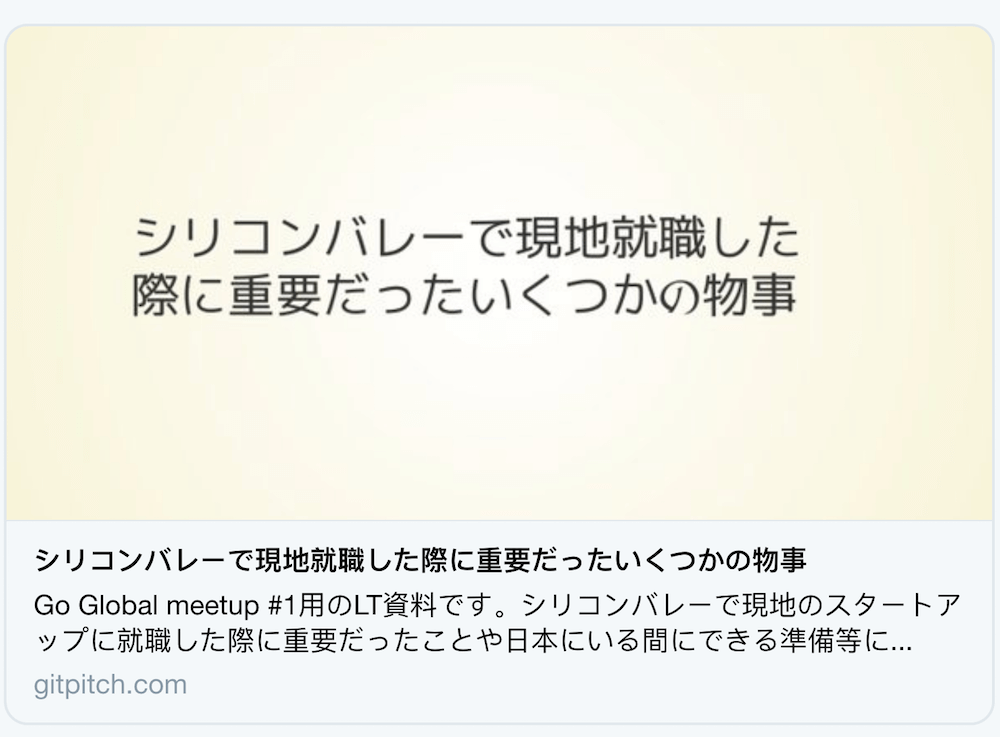

# Twitter Card Settings

### Purpose

A combination of `title`, `description`, and `thumbnail` settings let you customize the details of a Twitter Card or other Open Graph card for your slide deck.

### Syntax

```yaml
title : "What is Serverless?"
description : "Serverless is a mindset and a design not a technology."
thumbnail : assets/img/mindset.png
```
### Details

?> Settings are activated using the [PITCHME.yaml](/conventions/pitchme-yaml.md) for your slide deck.

When activated, these setting are used to populate a *Twitter Card* or other *Open Graph* card when you share a link to your slideshow presentation on services like Twitter, Slack, LinkedIn, etc.

If you do not provide custom values for these settings in your PITCHME.yaml file then default values are automatically assigned by GitPitch.

?> Note, the optimal *width:height* display ratio for a thumbnail image is 1.81:1.

### Examples

Here is an example GitPitch slideshow presentation using custom *Twitter Card* settings being displayed on Twitter:



Here is the default *Twitter Card* display for a GitPitch slideshow presentation that has not set custom values for these settings:


### Testing

Once you have activated the [required settings](#purpose) for the card in your PITCHME.yaml file we recommend testing the card for your slide deck before sharing it on Twitter, Slack, LinkedIn, etc.

Twitter provides a simple validator service where you can quickly test and preview your card by providing the URL to your GitPitch slide deck.

```text
https://cards-dev.twitter.com/validator
```

Simply open the above URL in your browser and then input the URL for your slide deck. When you click **Preview Card** this service will render a preview of your card.

This is a great way to verify you are publishing the correct title, description, and image for your deck before you sharing publicly on social media.

One additional feature of using the simple Twitter validator service is that it causes cached Twitter card data for your deck to be discarded. That means if you update any of the card properties for your deck, you can use this service to flush the Twitter cache, thereby ensuring your audience will start to see your new card properties.
