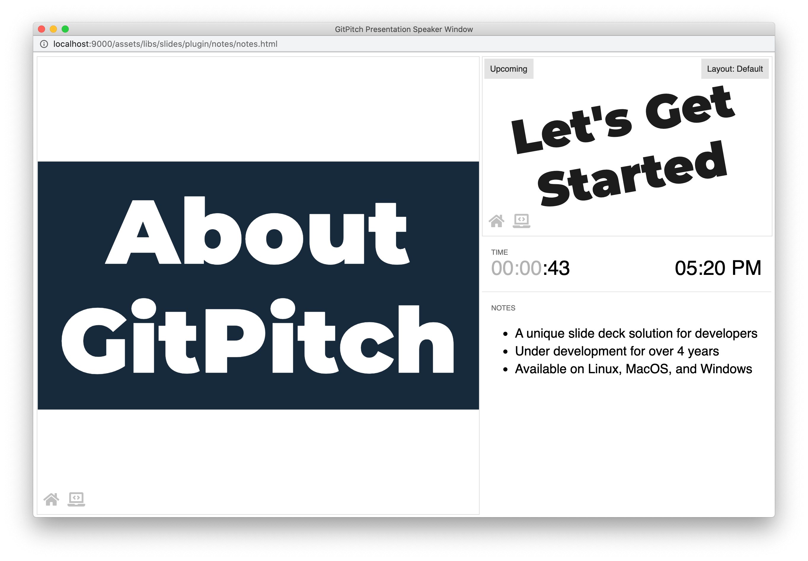

# Speaker Notes

Speaker notes let you add private annotations to slides. Including hints, tips, and reminders on specific slides that can help you to stay *on-track* and *on-point* during a live presentation.

### Notes Syntax

Use a special `Note:` marker syntax to add notes to any slide. The marker should be added to the end of a slide after any slide content. The notes themselves should be added directly after the note marker as shown here:

```markdown
[drag=100, drop=center, fit=2.1]
# About GitPitch

Note:

- A unique slide deck solution for developers
- Under development for over 4 years
- Available on Linux, MacOS, and Windows
```

The slide itself is rendered as expected without any change to its content  as shown here:


However when this slide is viewed within the [speaker window](/speaker/window.md) the notes on the slide are visibile to the presenter. Importantly these notes are not visible to your audience:



