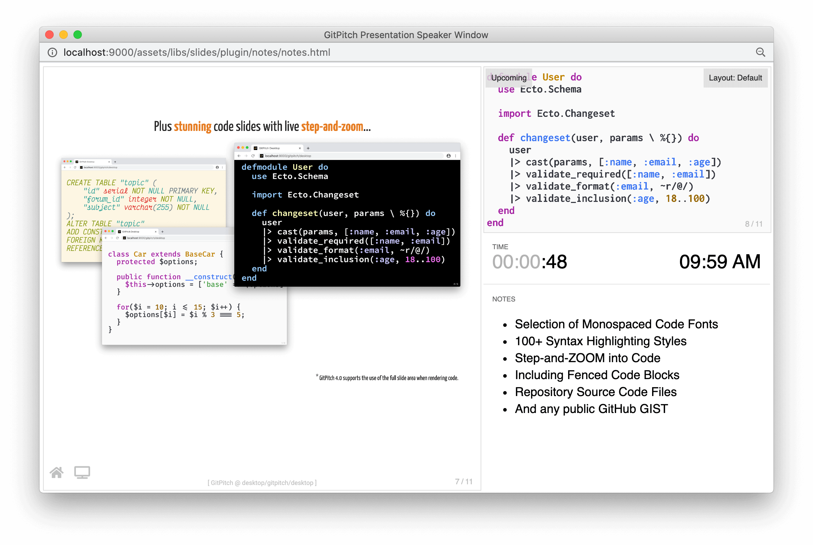

# Speaker Window

The speaker window provides a unique view of your slide deck tailored for use during live presentations providing the following features:

- Displays the current slide in the deck
- Displays speaker notes for the current slide
- Displays a preview for the next slide in the deck
- Displays a timer and clock to help keep track of time
- Forwards all navigations to the main presentation window



To open the speaker window within any slide deck simply press the `S` key on your keyboard.

### Disable Window

There are times when you may want to disable the speaker window functionality for a slide deck. For example when you [publish and share](/cloud/) a slide deck with your audience online following a tech conference or meetup.

To turn off speaker window funtionality disable the `speaker-mode` property in the [PITCHME.yaml](/conventions/pitchme-yaml/md) settings for your slide deck:

```yaml
speaker-mode : false
```

By deafult the `speaker-mode` setting is enabled for all slide decks.

