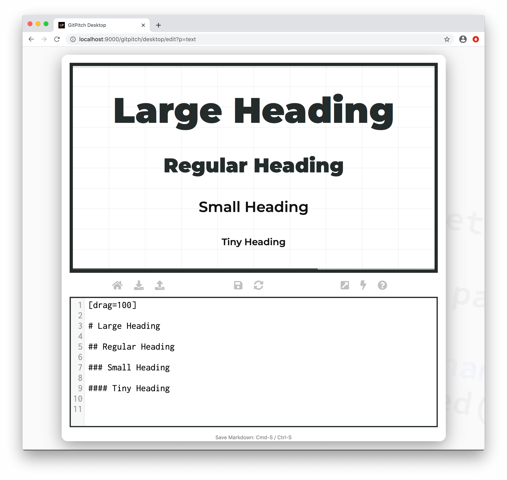
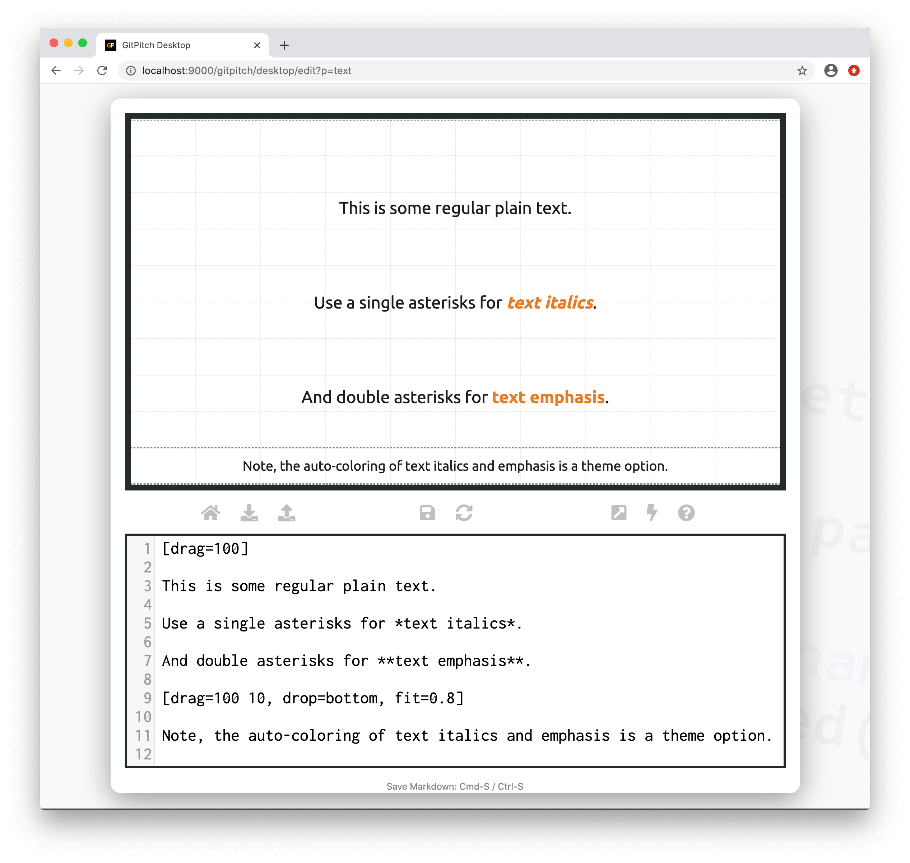
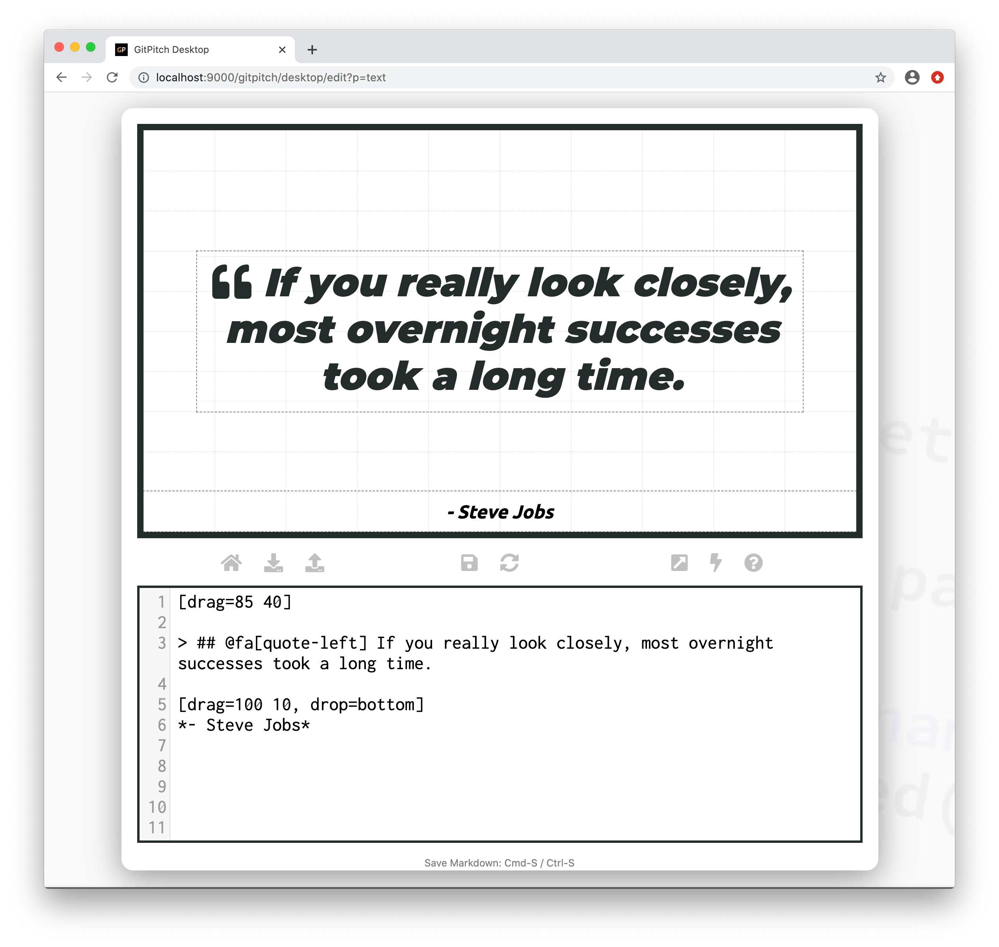
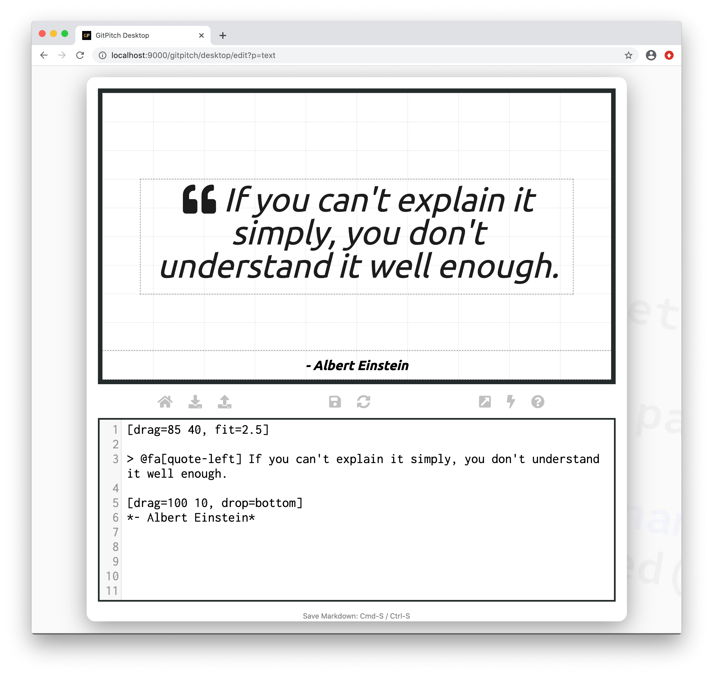

# Text Content

Text content including headings, lists, plain text and quotes are rendered using [standard markdown](https://guides.github.com/features/mastering-markdown/).

?> Additional text effects including positioning, sizing, and styling can be achieved using [Grid Layouts](/grid-layouts/), [Grid Fit](/grid-layouts/fit-text.md) and [custom style rules](/theme/custom-css.md) respectively.

### Headings



Copy this markdown snippet to experiment with heading content within your own slide deck:

```markdown
[drag=100, drop=center]

# Large Heading
## Regular Heading
### Small Heading
#### Tiny Heading
```

### Text Emphasis



Copy this markdown snippet to experiment with text emphasis within your own slide deck:

```markdown
[drag=100, drop=center]

This is some regular plain text.
Use a single asterisks for *text italics*.
And double asterisks for **text emphasis**.

[drag=100 10, drop=bottom, fit=0.8]

Note, the auto-coloring of text italics and emphasis is a theme option.
```

[List Markdown Syntax](../_snippets/list-markdown-syntax.md ':include')

?> For advanced behaviors and styles unique to lists see the [List Widgets Guide](/lists/widgets.md).


Copy this markdown snippet to experiment with lists within your own slide deck:

```markdown
[drag=50 100, drop=topleft]

- Each unordered list item
- Starts with a dash
- Followed by the item text

[drag=50 100, drop=right]

1. Each ordered list item
1. Starts with a number and dot
1. Followed by the item text
```

### Nested Lists

?> For advanced behaviors and styles unique to lists see the [List Widgets Guide](/lists/widgets.md).


Copy this markdown snippet to experiment with nested lists within your own slide deck:

```markdown
[drag=50 100, drop=topleft]
- For nested unordered lists
    - Indent each sub item
    - With 4 spaces
- Alongside regular list items

[drag=50 100, drop=right]
1. For nested ordered lists
    - Indent each sub item
    - With 4 spaces
2. Alongside regular list items
```

### Quotes

?> The following sample slides for quotations take advantage of the [Font Awesome Widget](/media/fontawesome.md).



Copy this markdown snippet to experiment with quotes within your own slide deck:

```markdown
[drag=85 40, drop=center]

> ## @fa[quote-left] If you really look closely, most overnight successes took a long time.

[drag=100 10, drop=bottom]
*- Steve Jobs*
```



Copy this markdown snippet to experiment with quotes within your own slide deck:

```markdown
[drag=85 40, drop=center, fit=2.5]

> @fa[quote-left] If you can't explain it simply, you don't understand it well enough.

[drag=100 10, drop=bottom, set=text-black]
*- Albert Einstein*
```
