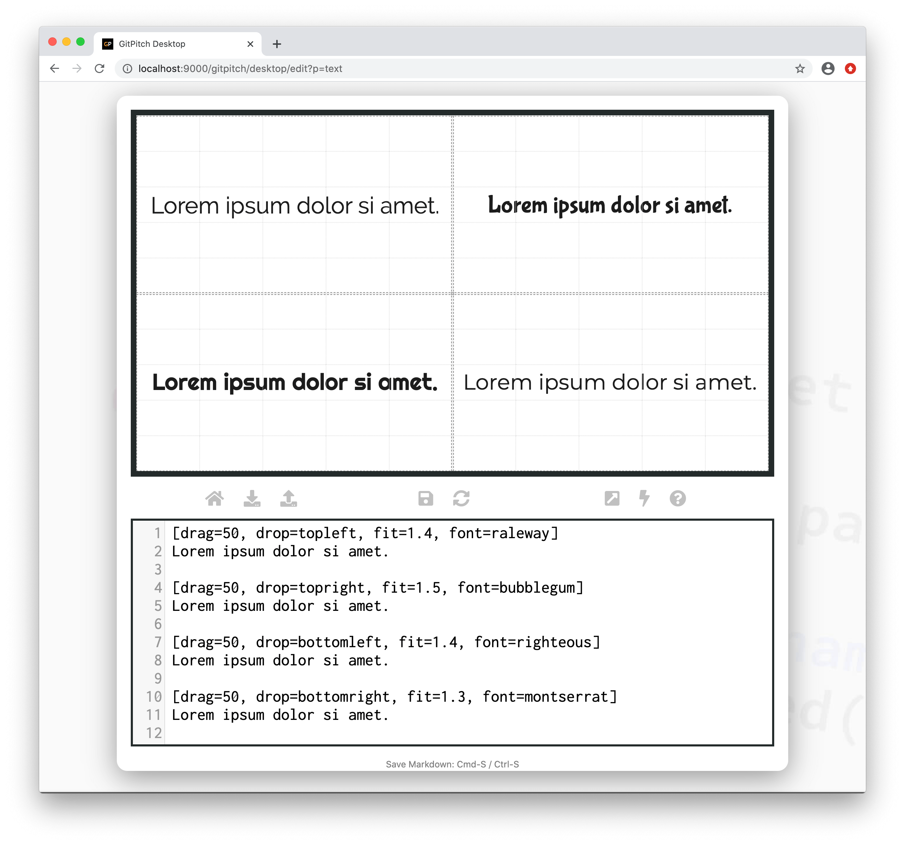

# Fonts

One of the best ways to make your slide deck stand out from the crowd is to use beautiful fonts. GitPitch has first class support for built-in fonts, licensed commercial fonts, and free Web fonts including [Google Web Fonts](/theme/custom-fonts.md).

### Built-In Fonts

The [base theme](/theme/template.md) for GitPitch slide decks ships with built-in support for 16 different fonts that can be used on any slide. You can use these fonts to activate default fonts for headline, byline, and plain text content using the [Theme Builder](/theme/builder.md).

### Grid Fonts

The grid *font* property is used to activate a custom font for plain text content in any [layout block](/grid-layouts/drag-and-drop.md).



Using the grid *font* property you can activate any built-in font or custom font to override the default font in your base theme for plain text only. You will need to define your own custom styles if you want to activate custom fonts to override your base theme for headline or byline content. For example:

```yaml
.headline-ubuntu h1,
.headline-ubuntu h2 { font-family: "Ubuntu Heavy" !important; }

.byline-quicksand h3,
.byline-quicksand h4 { font-family: "Quicksand Medium" !important; }
```

Activating your custom font styles for headline or byline content using the [Grid Set Property](/grid-layouts/set.md) as follows:

```markdown
[drag=80, set=headline-ubuntu byline-quicksand]

# Let's Get Started

### Markdown for Slide Decks
```

### Custom Fonts

Support for custom fonts lets you accurately reflect the brand of any project, conference, or business within GitPitch slide decks. Details are found in the [Custom Fonts Guide](/theme/custom-fonts.md).
