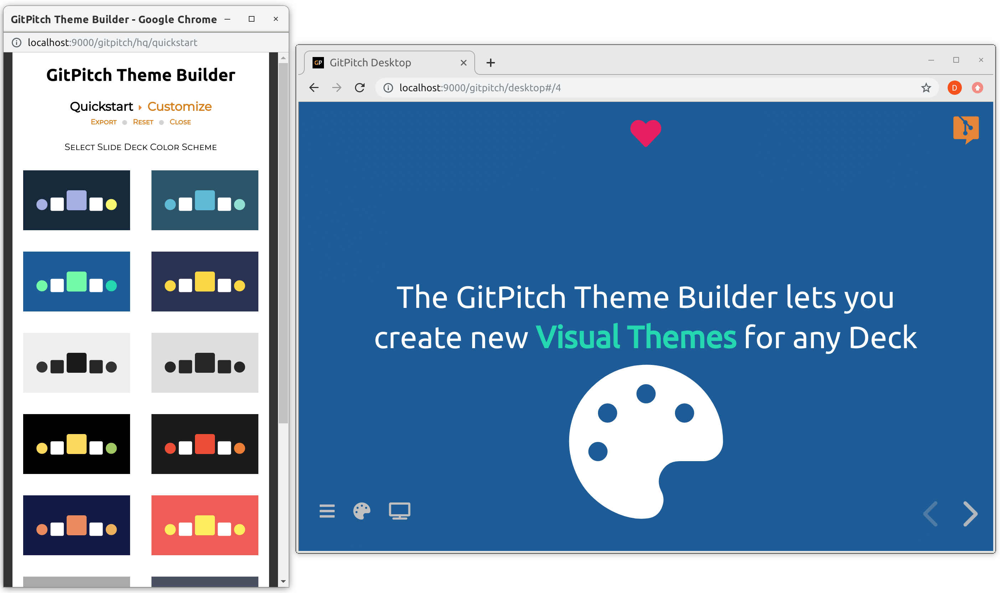
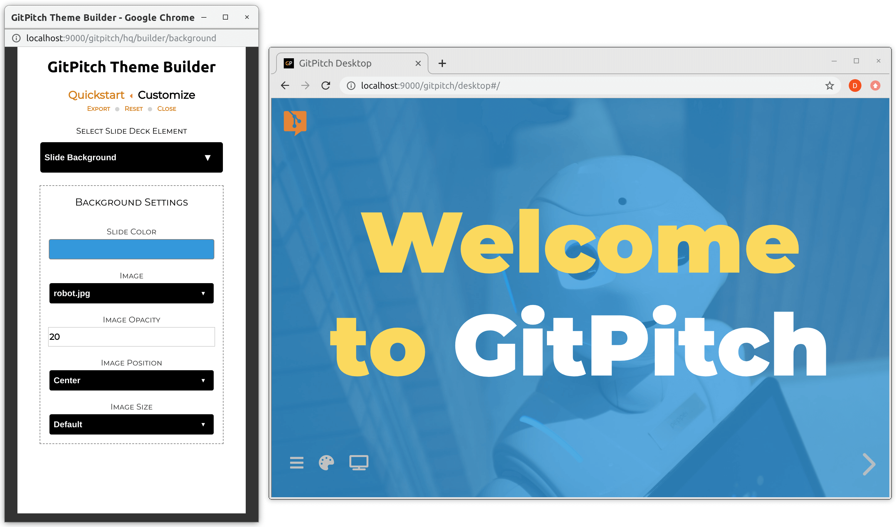
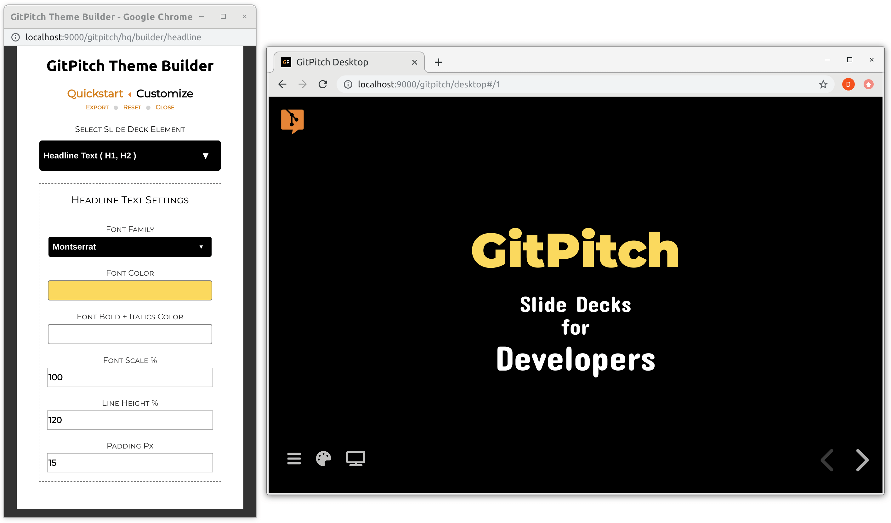
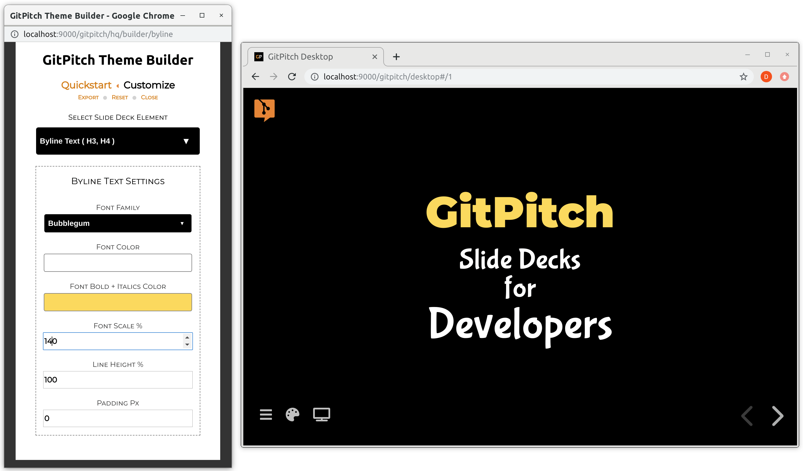
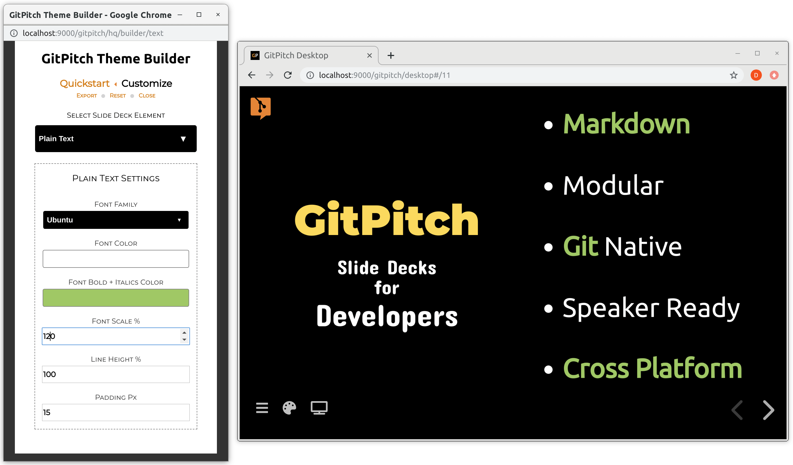
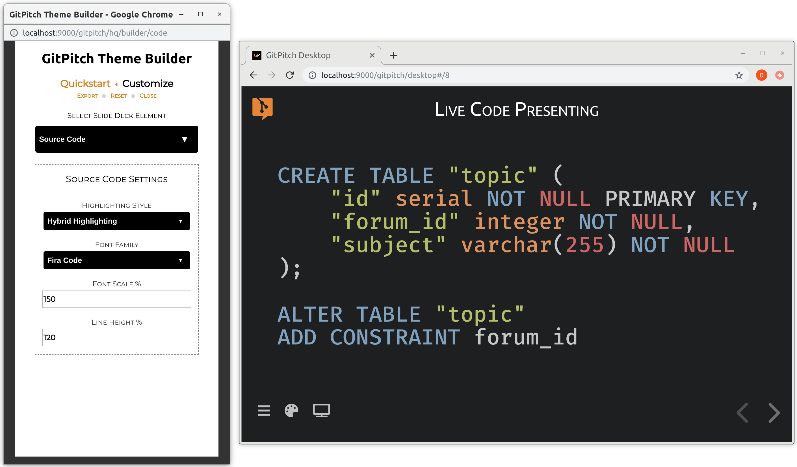

# The Theme Builder

The **Theme Builder** is an interactive tool for creating custom visual themes for GitPitch slide decks. The theme builder is accessed directly within [GitPitch Desktop](/desktop/). To launch the theme builder, open any slide deck and press the `T` key on your keyboard.

<iframe id="youtube" width="900" height="600" src="https://www.youtube.com/embed/pfMsOZRvfXw" frameborder="0" allow="accelerometer; autoplay; encrypted-media; gyroscope; picture-in-picture" allowfullscreen></iframe>

?> All theme builder customizations apply to content across every slide in your slide deck.

### Color Scheme

By default, GitPitch slide decks inherit a simple color scheme out-of-the-box.
Using the theme builder *Quickstart* feature you can activate a brand new
color scheme for your deck with just one click.



GitPitch includes 16 attractive themes that are designed to work for
any audience, whether it's a tech conference, meetup, or training course.
You can further customize any aspect of these quickstart themes using the 
*theme customization* features that follow.

### Slide Background

The theme builder offers the following customizations for the slide background in your deck:

1. Custom slide background color
1. An optional custom slide background image
1. Slide background image opacity, positioning, and sizing controls



Note, the theme builder automatically detects all images in your working directory and presents those image files for selection under the *Image* drop-down on this panel.

### Headline Text

The theme builder offers the following customizations for headline (H1, H2) text appearing on slides within your deck:

1. Custom font family for headline text
1. Custom color for headline text
1. Custom emphasis color for headline bold and italics
1. Custom scale, line height, and padding for headline text



Note, padding refers to the vertical space injected below headline text on the slide. This property can be used to control spacing between headline text and any content that immediately follows on your slide.

?> All custom padding values are superceded for slide content rendered under [Grid Layouts Flow](/grid-layouts/flow.md).

### Byline Text

The theme builder offers the following customizations for byline (H3, H4) text appearing on slides within your deck:

1. Custom font family for byline text
1. Custom color for byline text
1. Custom emphasis color for byline bold and italics
1. Custom scale, line height, and padding for byline text



Note, padding refers to the vertical space injected below byline text on the slide. This property can be used to control spacing between byline text and any content that immediately follows on your slide.

?> All custom padding values are superceded for slide content rendered under [Grid Layouts Flow](/grid-layouts/flow.md).

### Plain Text

The theme builder offers the following customizations for plain text appearing on slides within your deck:

1. Custom font family for plain text
1. Custom color for plain text
1. Custom emphasis color for plain text bold and italics
1. Custom scale, line height, and padding for plain text



Note, padding refers to the vertical space injected below plain text on the slide. This property can be used to control spacing between plain text and any content that immediately follows on your slide.

?> All custom padding values are superceded for slide content rendered under [Grid Layouts Flow](/grid-layouts/flow.md).

### Source Code

The theme builder offers the following customizations for source code blocks appearing on slides within your deck:

1. Custom syntax highlighting style for source code blocks
1. Custom monospaced font family for source code blocks
1. Custom scale and line height for source code blocks



Note, the source code scale and line height settings can be overridden for individual code blocks on any slide using [Grid Fit for Code](/grid-layouts/fit-code.md) support.

### General Settings

The theme builder offers the following general customizations for your slide deck:

1. Custom auto-layout policy for slide content
1. Custom logo image and logo positioning 
1. Custom color for hyperlinks on your slides
1. Custom color for deck navigation and menu icons


!> The auto-layout policy has no effect on slide content under [Grid Layouts](/grid-layouts/) control.

Note, the theme builder automatically detects all images in your working directory and presents those image files for selection under the *Logo Image* drop-down on this panel.

### Export Theme

The theme builder manipulates properites associated with the [theme template](/themes/template) directly within the [PITCHME.yaml](/conventions/pitchme-yaml.md) for your slide deck.

To export the full set of settings for your current custom theme, click the *Export* link in the builder. Exported theme settings can be shared across projects or an entire organization.  Sharing theme settings in this way can be used to guarantee a consistent style and brand for slide decks across projects and teams.

### Disable Builder

The `theme-builder` setting is used to enable or disable access to the Theme Builder within [GitPitch Desktop](/desktop/).

#### Syntax

```yaml
theme-builder : false
```

#### Details

?> Settings are activated using the [PITCHME.yaml](/conventions/pitchme-yaml.md) for your slide deck.

When disabled the `theme-builder` setting deactivates the Theme Builder within the desktop app. Use of this setting can help to prevent the accidental modification of custom theme settings. This is particularly useful when two or more users are collaborating on the content of a slide deck.

By default, the `theme-builder` setting is enabled.

