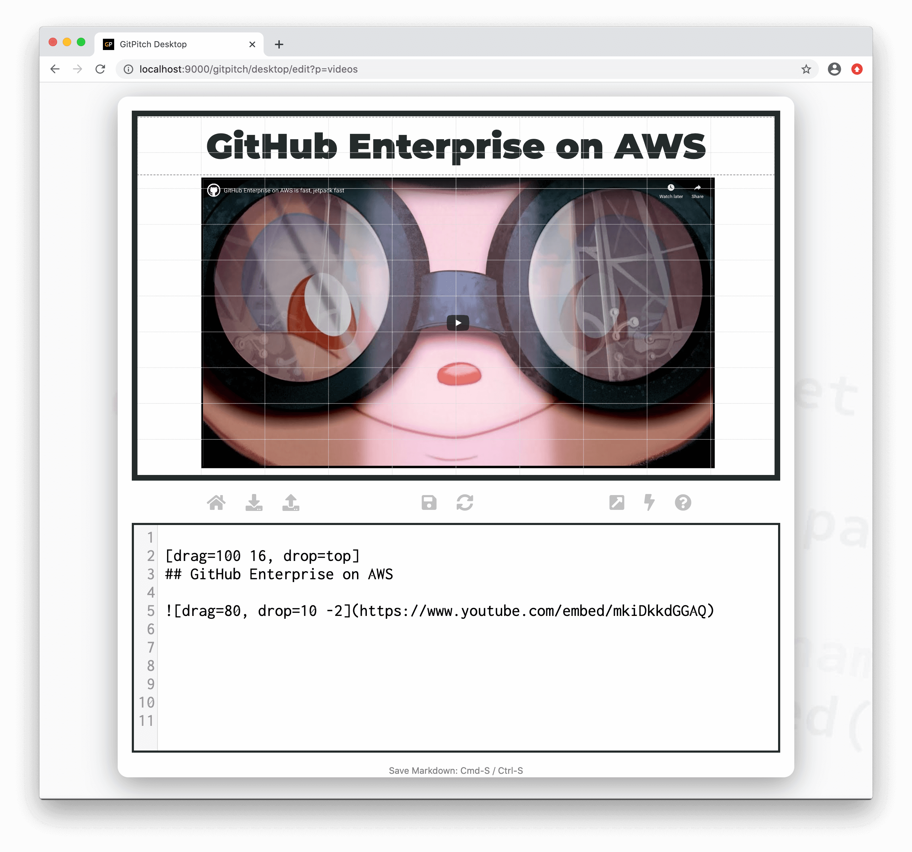
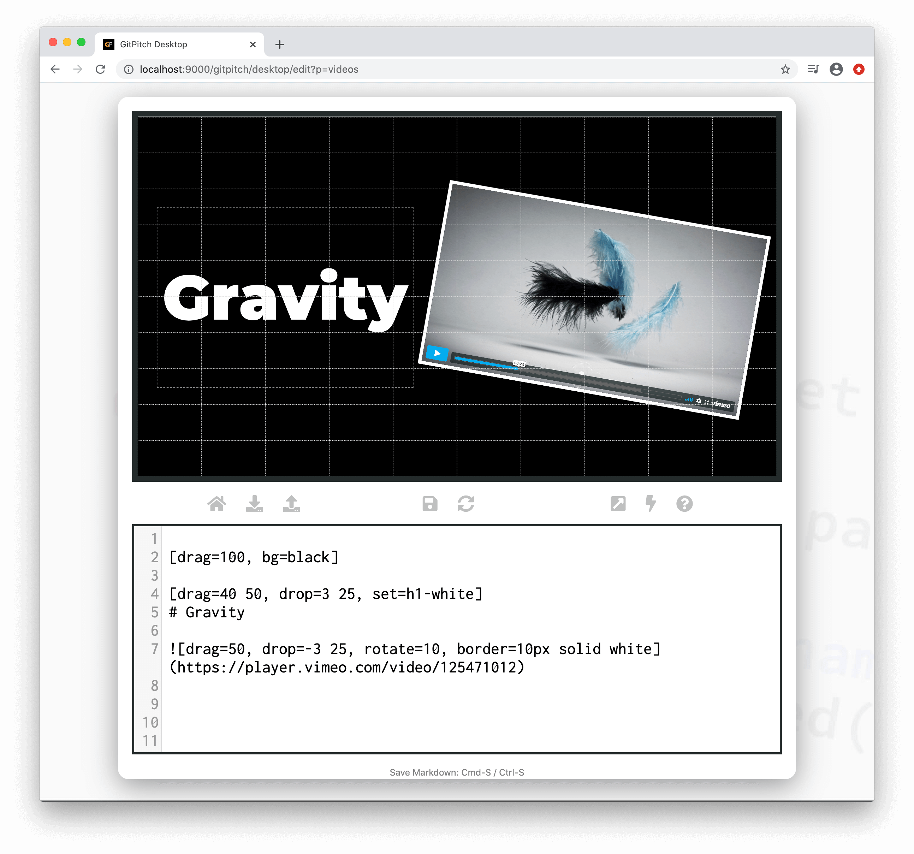
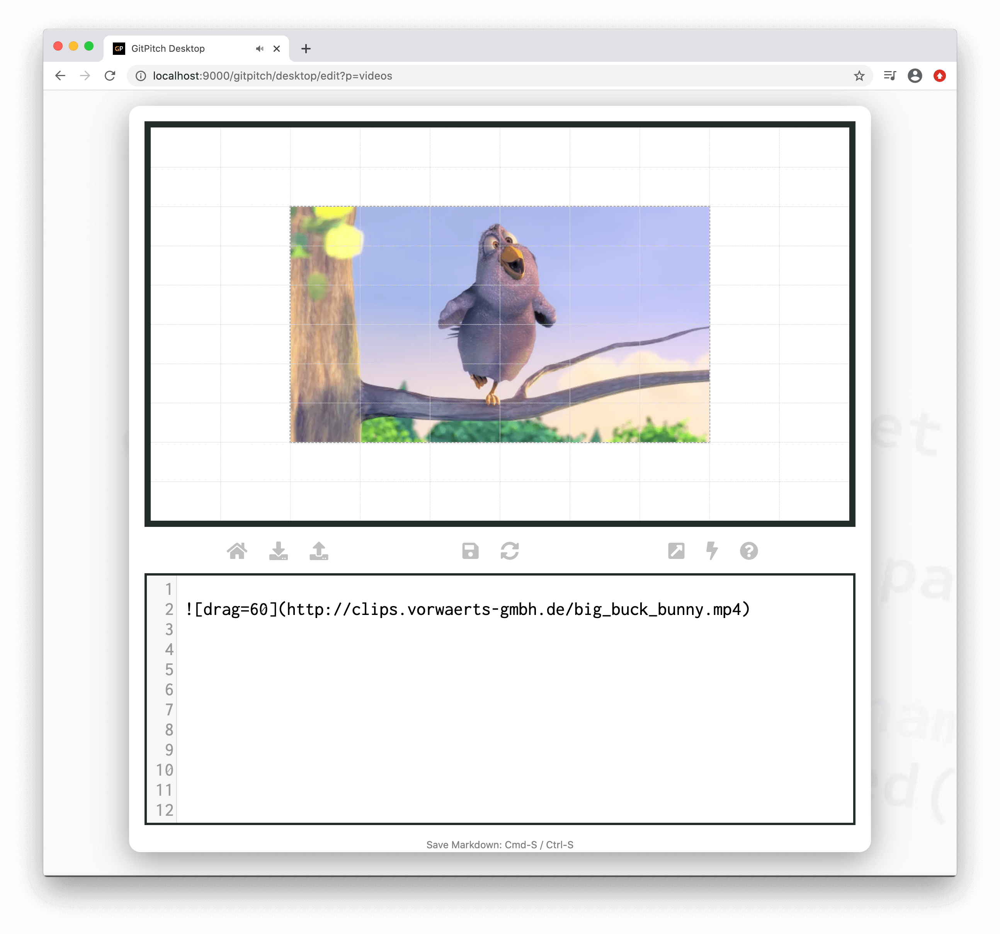

# Video Widget

?> GitPitch widgets greatly enhance traditional markdown rendering capabilities for slide decks.

The video widget extends traditional markdown image syntax with support for displaying, positioning, sizing, transforming, and filtering video content.

### Widget Paths

All paths to video content specified within [PITCHME.md](/conventions/pitchme-md.md) markdown must be absolute paths to video content hosted on video streaming CDNs such as YouTube or Vimeo. 

### Widget Syntax

The following markdown snippet demonstrates video widget syntax:

```markdown

```

?> The `properties...` list expects a comma-separated list of property `key=value` pairs.

### Video Properties

The video widget supports the following video specific properties:

[Video Widget Properties](../_snippets/video-widget-properties.md ':include')

### Grid Native Props

The *Video Widget* is a [grid native widget](/grid-layouts/native-widgets.md) meaning it also directly supports [grid layouts](/grid-layouts/) properties:

[Grid Widget Properties](../_snippets/grid-widget-properties.md ':include')

### YouTube

The following slide demonstrates a YouTube video rendered using video widget syntax. The markdown snippet used to create this slide takes advantage of numerous *grid native properties* to position, size, and transform the video on the slide:



### Vimeo

The following slide demonstrates a Vimeo video rendered using video widget syntax. The markdown snippet used to create this slide takes advantage of numerous *grid native properties* to position, size, and transform the video on the slide:



### MP4 Video

The following slide demonstrates an MP4 video rendered using video widget syntax. The markdown snippet used to create this slide takes advantage of numerous *grid native properties* to position, size, and transform the video on the slide:



